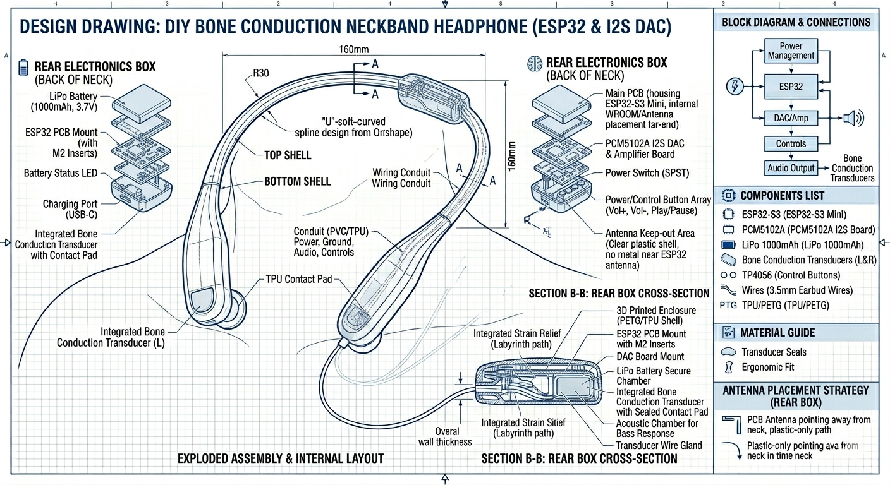

# july 23: started design of headphones
i started designing the prototypes and came up with a design drawing, which entails what the design will look like and how it works. its is based off a esp32 s3 and a small audio amplifier, which connects to the vibration pads, which sit in a tpu housing, making it sweat and dust resistant. it has a small lipo battery which charges using usb-c via a power controller.

**total time spent: 2 hours**

---

# july 23: detailed CAD & exploded assembly design
worked on breaking down the full internal layout and exploded assembly for the neckband. finalized the rear electronics box containing the ESP32-S3 Mini, PCM5102A I2S DAC board, and 1000mAh LiPo battery. mapped out the wiring conduits running through the flexible TPU housing down to the contact pads, and designed a labyrinth-style strain relief to keep the wiring durable.

**total time spent: 2.5 hours**

---

# july 23: component sourcing & bill of materials
spent time searching for all necessary electronic modules, hardware, and raw materials needed to construct the design. sourced the ESP32-S3 Mini, PCM5102A DAC, TP4056 USB-C charging module, 1000mAh LiPo battery, bone conduction transducers, tactile buttons, M2 heat-set inserts, silicone wiring, and 3D printing filaments from single-supplier options to streamline procurement.

**total time spent: 5 hours**