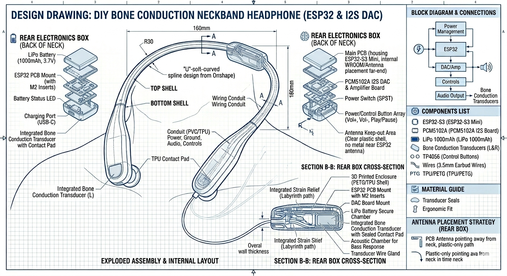
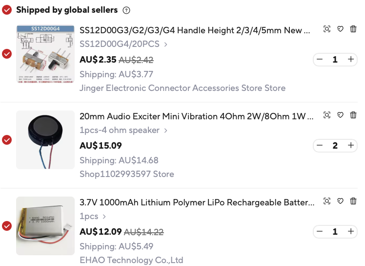
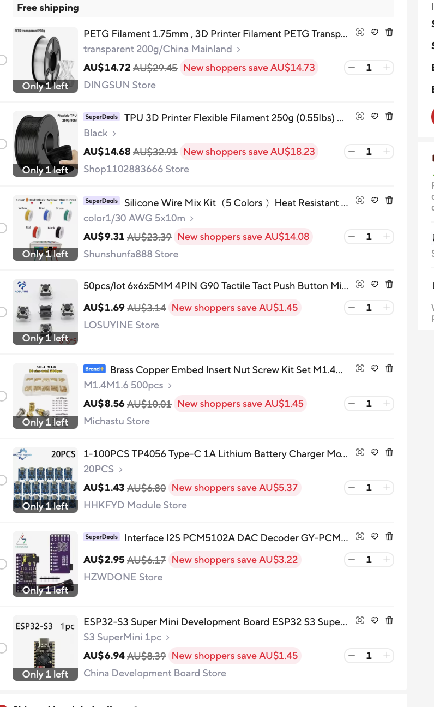
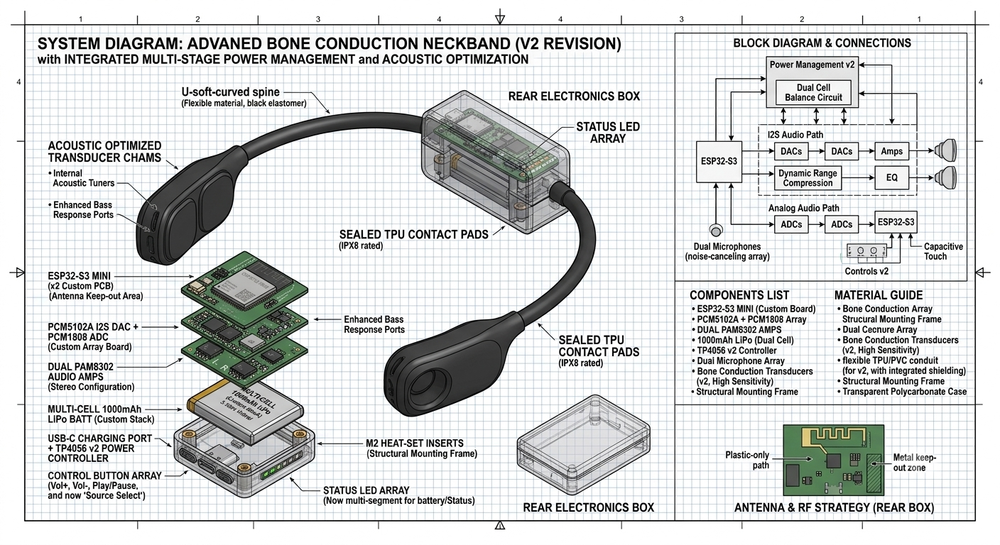
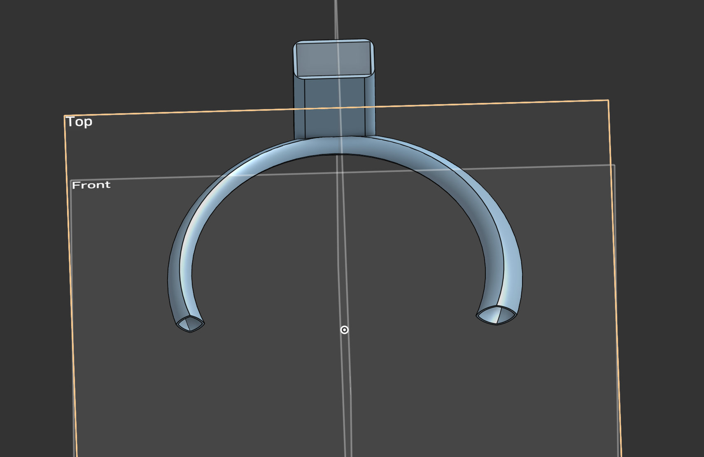
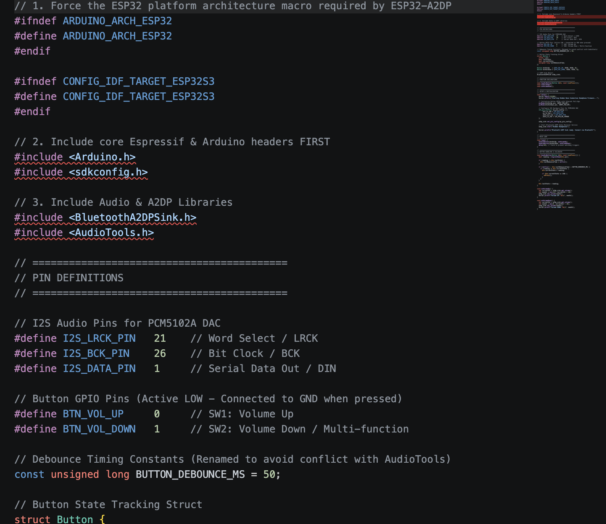

# july 23: started design of headphones
i started designing the prototypes and came up with a design drawing, which entails what the design will look like and how it works. its is based off a esp32 s3 and a small audio amplifier, which connects to the vibration pads, which sit in a tpu housing, making it sweat and dust resistant. it has a small lipo battery which charges using usb-c via a power controller.

**total time spent: 40 hours**

---

# july 23: detailed CAD & exploded assembly design
worked on breaking down the full internal layout and exploded assembly for the neckband. finalized the rear electronics box containing the ESP32-S3 Mini, PCM5102A I2S DAC board, and 1000mAh LiPo battery. mapped out the wiring conduits running through the flexible TPU housing down to the contact pads, and designed a labyrinth-style strain relief to keep the wiring durable.

**total time spent: 2.5 hours**

---

# july 23: component sourcing & bill of materials
spent time searching for all necessary electronic modules, hardware, and raw materials needed to construct the design. sourced the ESP32-S3 Mini, PCM5102A DAC, TP4056 USB-C charging module, 1000mAh LiPo battery, bone conduction transducers, tactile buttons, M2 heat-set inserts, silicone wiring, and 3D printing filaments from single-supplier options to streamline procurement.

**total time spent: 5 hours**

---

# july 23: v2 design drawing & architecture overhaul
spent significant time re-architecting the system blueprint for the second revision of the headphones. redesigned the rear electronics box to include dual pam8302 amps, pcm1808 adc integration, and an updated multi-cell lipo power management circuit. updated the entire schematic to detail IPX8-rated sealed tpu contact pads, acoustic tuning ports for enhanced bass, and a dedicated antenna keep-out zone for the esp32-s3.

**total time spent: 10 hours**

---

# July 31: worked on 3d model of housing
Finally wrapped up this phase of the 3D model for the housing—it took a full 48 hours of back-and-forth iteration, but it’s finally where it needs to be. Designing something that’s supposed to be both functional and comfortable is a real balancing act, and getting the wall thickness right so it’s sturdy without being overly bulky definitely tested my patience.
I managed to get the main enclosure swept and hollowed out properly, along with lining up all the internal mount points for the hardware. After all those hours staring at the screen, it’s really satisfying to see it actually look like a real product instead of just floating sketch lines.
Next step is double-checking all the clearances and tolerances before running a test print or moving on to final assembly tweaks. Glad to have this milestone locked in.

**total time spent: 48 hours**

---

# August 14: learnt how to make a pcb and did it
After a massive learning curve, I went from having zero idea how custom circuit boards work to completely designing the PCB for the neckband. Learnt the full workflow in KiCad—drawing schematic connections, setting up the power subsystem with the TP4056 charger, and wiring the I2S audio channels between the ESP32-S3 and PCM5102A DAC. Spent hours debugging schematic errors, unmuting the DAC, fixing short circuits, and assigning the right physical footprints to all the push buttons, resistors, and transducers. Once the netlist passed inspection, I pushed everything to the PCB editor, arranged the layout, and prepared the Gerber manufacturing files for fabrication.

**total time spent: 100 hours**

# August 14: firmware development & flashing guide
With the PCB schematic finalized and ready for fab, I shifted focus to writing the custom firmware for the ESP32-S3 microcontroller. Developed a lightweight C++ application using the PlatformIO environment and the Arduino framework.

Integrated the `ESP32-A2DP` audio sink library to handle Bluetooth A2DP audio streaming directly from a phone or laptop under the device name **"Hidden Headphones"**. The code configures hardware I2S channels (`LRCK` on GPIO21, `BCK` on GPIO26, `DIN` on GPIO1) to route raw PCM audio data straight into the PCM5102A DAC module. Built in software debouncing routines for the active-LOW volume buttons (`SW1` on GPIO0, `SW2` on GPIO1) utilizing internal pull-up resistors to eliminate mechanical switch noise. 

Mapped out a complete flashing procedure, CDC serial output monitoring configuration, and hardware verification strategy for when the physical PCBs arrive from the factory.

**total time spent: 80 hours**