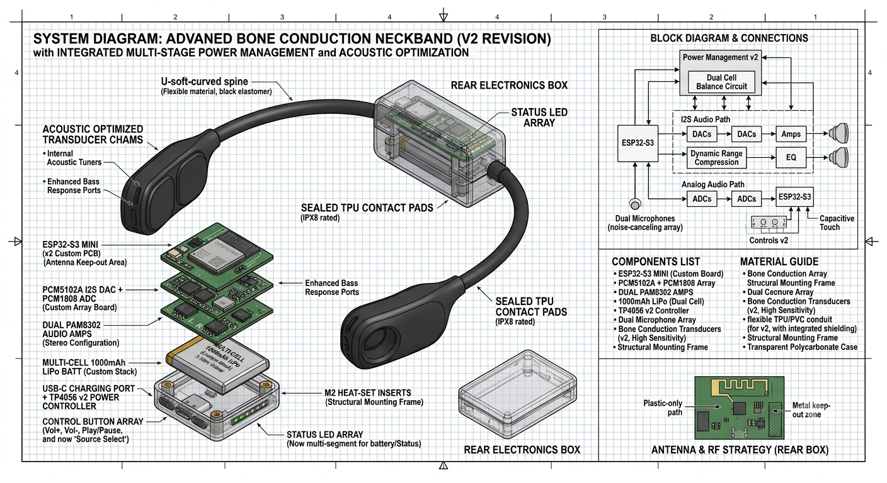

# Hidden Headphones

> **Bone conduction headphones that sit on your collarbone, completely hidden under your shirt.**

Hidden Headphones is an open-source hardware project designed to create a discrete, neckband-style bone conduction audio device. Powered by an ESP32-S3 microcontroller, the device transmits audio through contact pads resting on the collarbone, offering a completely hands-free and hidden listening experience.

---

## Overview & Architecture



The project utilizes custom-designed housing, optimized power delivery, and high-efficiency audio drivers:

* **Core Processor:** ESP32-S3 Mini (Wi-Fi & Bluetooth)
* **Audio Pipeline:** PCM5102A I2S DAC + Dual PAM8302 Audio Amplifiers
* **Transducers:** High-sensitivity stereo bone conduction transducers in IPX8 sealed TPU contact pads
* **Power Management:** TP4056 USB-C charging controller with a 1000mAh LiPo battery
* **Housing:** Flexible TPU/PETG neckband conduit with labyrinth-style strain relief and acoustic bass tuning chambers

---

## Project Structure

```text
.
├── JOURNAL.md          # Project development logs & time tracking
├── LICENSE             # Open-source license (CC0-1.0)
├── README.md           # Project overview and guide
└── images/             # Diagrams, CAD renders, and BOM screenshots
    ├── cart-1.png
    ├── cart-2.png
    ├── design-v1.png
    └── design-v2.png